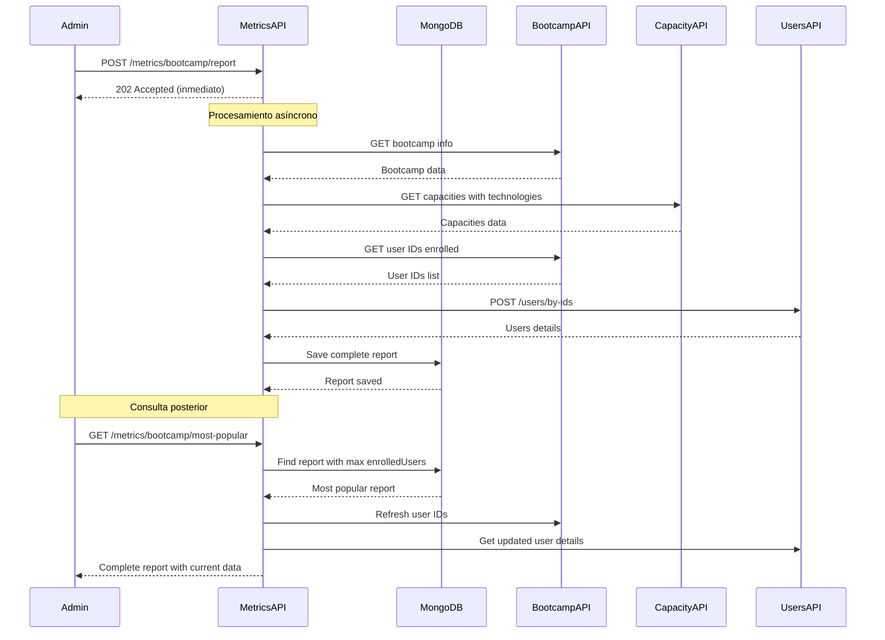

# 🎯 Metrics API - Microservicio de Reportes de Bootcamps

## 📋 Descripción

Microservicio reactivo para el registro y consulta de métricas de bootcamps. Utiliza MongoDB para almacenamiento y sigue una arquitectura hexagonal con Spring WebFlux.

---

## 🏗️ Arquitectura

### Arquitectura Hexagonal (Puertos y Adaptadores)

```
┌─────────────────────────────────────────────────────────────┐
│                      METRICS-API (Puerto 8083)               │
├─────────────────────────────────────────────────────────────┤
│  📥 ENTRADA (Adapters In)                                    │
│  ├── RouterRest                                              │
│  ├── BootcampReportHandlerImpl                               │
│  ├── JwtAuthenticationFilter                                 │
│  └── SecurityConfig                                          │
├─────────────────────────────────────────────────────────────┤
│  🎯 DOMINIO (Core Business Logic)                            │
│  ├── BootcampReportUseCase                                   │
│  ├── Models: BootcampReport, UserEnrollment, etc.            │
│  └── Ports: BootcampReportServicePort, *PersistencePort      │
├─────────────────────────────────────────────────────────────┤
│  📤 SALIDA (Adapters Out)                                    │
│  ├── MongoDB Adapter                                         │
│  │   ├── BootcampReportPersistenceAdapter                    │
│  │   ├── BootcampReportRepository                            │
│  │   └── BootcampReportEntity                                │
│  └── External Services Adapters                              │
│      ├── BootcampWebClient → bootcamp-api (8080)             │
│      ├── CapacityWebClient → capacity-api (8082)             │
│      └── UserWebClient → users-api (8081)                    │
└─────────────────────────────────────────────────────────────┘
```

---

## 🚀 Funcionalidades

### 1️⃣ **Registrar Reporte de Bootcamp (Asíncrono)**

**Endpoint:** `POST /metrics/bootcamp/report`  
**Rol requerido:** `ADMIN`  
**Descripción:** Registra un reporte completo del bootcamp de forma asíncrona (Fire and Forget)

**Request:**
```json
{
  "bootcampId": 1
}
```

**Response (202 Accepted):**
```json
{
  "code": "202",
  "message": "Bootcamp report registration initiated",
  "identifier": "uuid-message-id",
  "date": "2026-01-22T10:30:00"
}
```

**Flujo:**
1. Responde inmediatamente con 202 Accepted
2. En background consulta:
   - Información del bootcamp (bootcamp-api)
   - Capacidades con tecnologías (capacity-api)
   - Usuarios inscritos (bootcamp-api)
   - Detalles de usuarios (users-api)
3. Guarda en MongoDB con todas las métricas calculadas

**Datos almacenados:**
- Información completa del bootcamp
- Cantidad de capacidades
- Cantidad de tecnologías (suma de todas las capacidades)
- Cantidad de personas inscritas
- Lista de usuarios con nombre y email
- Lista de capacidades con sus tecnologías

---

### 2️⃣ **Obtener Bootcamp Más Popular**

**Endpoint:** `GET /metrics/bootcamp/most-popular`  
**Rol requerido:** `ADMIN`  
**Descripción:** Retorna el bootcamp con mayor cantidad de personas inscritas con información actualizada

**Response (200 OK):**
```json
{
  "id": "mongodb-id",
  "bootcampId": 1,
  "bootcampName": "Bootcamp Java Backend",
  "bootcampDescription": "Desarrollo backend con Spring Boot",
  "launchDate": "2026-03-01",
  "duration": 90,
  "capacityCount": 4,
  "technologyCount": 12,
  "enrolledUsersCount": 45,
  "enrolledUsers": [
    {
      "userId": 10,
      "userName": "María García",
      "userEmail": "maria@example.com"
    },
    {
      "userId": 11,
      "userName": "Juan Pérez",
      "userEmail": "juan@example.com"
    }
  ],
  "capacities": [
    {
      "capacityId": 1,
      "capacityName": "Java",
      "technologies": [
        {
          "technologyId": 1,
          "technologyName": "Spring Boot"
        },
        {
          "technologyId": 2,
          "technologyName": "JPA"
        }
      ]
    }
  ],
  "createdAt": "2026-01-22T10:00:00",
  "updatedAt": "2026-01-22T11:30:00"
}
```

**Flujo:**
1. Consulta MongoDB para obtener el reporte con mayor `enrolledUsersCount`
2. Actualiza los usuarios inscritos consultando bootcamp-api y users-api
3. Retorna información completa y actualizada

---

## 🔐 Seguridad

### Configuración Declarativa con Spring Security WebFlux

```java
// Solo ADMIN puede acceder a los endpoints de métricas
.pathMatchers(HttpMethod.POST, "/metrics/bootcamp/report").hasRole("ADMIN")
.pathMatchers(HttpMethod.GET, "/metrics/bootcamp/most-popular").hasRole("ADMIN")
```

### Autenticación JWT
- Token JWT requerido en header: `Authorization: Bearer {token}`
- Roles: `ROLE_ADMIN`, `ROLE_USER`
- Solo `ROLE_ADMIN` puede acceder a endpoints de métricas

---

## 🗄️ Base de Datos MongoDB

### Colección: `bootcamp_reports`

**Índices:**
- `bootcampId` (unique)
- `enrolledUsersCount` (para consultas de máximo)
- `createdAt` (para ordenamiento)

**Esquema del documento:**
```javascript
{
  _id: ObjectId,
  bootcampId: Long,
  bootcampName: String,
  bootcampDescription: String,
  launchDate: Date,
  duration: Integer,
  capacityCount: Integer,
  technologyCount: Integer,
  enrolledUsersCount: Integer,
  enrolledUsers: [
    {
      userId: Long,
      userName: String,
      userEmail: String
    }
  ],
  capacities: [
    {
      capacityId: Long,
      capacityName: String,
      technologies: [
        {
          technologyId: Long,
          technologyName: String
        }
      ]
    }
  ],
  createdAt: DateTime,
  updatedAt: DateTime
}
```

---

## ⚙️ Configuración

### application.yaml

```yaml
server:
  port: 8083

spring:
  application:
    name: metrics-api
  data:
    mongodb:
      uri: mongodb://localhost:27017/bootcamp_metrics
      database: bootcamp_metrics

jwt:
  secret: mySecretKeyForJWT2026ThisIsA32CharacterKeyMinimumForHS256Algorithm
  expiration: 3600000

external:
  bootcamp:
    base-url: http://localhost:8080
  capacity:
    base-url: http://localhost:8082/capacity
  user:
    base-url: http://localhost:8081
```

---

## 🧪 Pruebas con Postman

### Configurar Variables de Entorno
```
admin_token: {tu_token_de_admin}
metrics_base_url: http://localhost:8083/metrics
```

### 1. Obtener Token de Admin
```http
POST http://localhost:8081/auth/login
Content-Type: application/json

{
  "email": "admin@example.com",
  "password": "admin123"
}
```

### 2. Registrar Reporte de Bootcamp
```http
POST {{metrics_base_url}}/bootcamp/report
Content-Type: application/json
Authorization: Bearer {{admin_token}}

{
  "bootcampId": 1
}
```

### 3. Consultar Bootcamp Más Popular
```http
GET {{metrics_base_url}}/bootcamp/most-popular
Authorization: Bearer {{admin_token}}
```

---

## 🎯 Principios SOLID Aplicados

### ✅ Single Responsibility Principle (SRP)
- `BootcampReportUseCase`: Solo lógica de negocio de reportes
- `BootcampReportPersistenceAdapter`: Solo persistencia en MongoDB
- `BootcampWebClient`: Solo comunicación con bootcamp-api

### ✅ Open/Closed Principle (OCP)
- Puertos (interfaces) permiten extensión sin modificar código existente
- Nuevos adaptadores se pueden agregar sin cambiar el dominio

### ✅ Liskov Substitution Principle (LSP)
- Todas las implementaciones de puertos son intercambiables
- Los adaptadores implementan contratos definidos por interfaces

### ✅ Interface Segregation Principle (ISP)
- Interfaces pequeñas y específicas (un puerto por responsabilidad)
- `BootcampReportServicePort`, `BootcampReportPersistencePort`, etc.

### ✅ Dependency Inversion Principle (DIP)
- El dominio NO depende de la infraestructura
- Los adaptadores dependen de los puertos del dominio
- Inyección de dependencias con Spring

---

## 🔄 Programación Reactiva

### Características
- **100% No-Bloqueante**: Usa Reactor (Mono y Flux)
- **Asíncrono**: Registro de reportes no bloquea el cliente
- **Backpressure**: Manejo automático de presión
- **Composición**: Operaciones encadenadas reactivamente

### Ejemplo de Composición Reactiva
```java
// Consulta paralela de múltiples servicios
Mono<List<CapacityDetail>> capacitiesMono = capacityExternalServicePort
    .getCapacitiesWithTechnologies(capacityIds, messageId)
    .collectList();

Mono<List<Long>> userIdsMono = bootcampExternalServicePort
    .getUserIdsByBootcampId(bootcampId, messageId)
    .collectList();

return Mono.zip(capacitiesMono, userIdsMono)
    .flatMap(tuple -> {
        // Procesar resultados en paralelo
    });
```

### Fire and Forget Pattern
```java
// Responde inmediatamente, procesa en background
return buildBootcampReport(bootcampId, messageId)
    .flatMap(bootcampReportPersistencePort::save)
    .subscribeOn(Schedulers.boundedElastic())
    .then()
    .onErrorResume(ex -> Mono.empty()); // No propagar errores
```

---

## 📦 Dependencias Principales

```gradle
dependencies {
    // Spring Boot Reactive
    implementation 'org.springframework.boot:spring-boot-starter-webflux'
    implementation 'org.springframework.boot:spring-boot-starter-data-mongodb-reactive'
    implementation 'org.springframework.boot:spring-boot-starter-security'
    
    // JWT
    implementation 'io.jsonwebtoken:jjwt-api:0.11.5'
    implementation 'io.jsonwebtoken:jjwt-impl:0.11.5'
    implementation 'io.jsonwebtoken:jjwt-jackson:0.11.5'
    
    // Resilience4j
    implementation 'io.github.resilience4j:resilience4j-spring-boot2:2.2.0'
    implementation 'io.github.resilience4j:resilience4j-reactor:2.2.0'
    
    // Observability
    implementation 'org.springframework.boot:spring-boot-starter-actuator'
    implementation 'io.micrometer:micrometer-tracing-bridge-brave'
    
    // Lombok & MapStruct
    compileOnly 'org.projectlombok:lombok'
    annotationProcessor 'org.projectlombok:lombok'
    implementation 'org.mapstruct:mapstruct:1.6.0'
    annotationProcessor 'org.mapstruct:mapstruct-processor:1.6.0'
}
```

---

## 🚀 Ejecución

### 1. Iniciar MongoDB
```bash
docker run -d -p 27017:27017 --name mongodb mongo:latest
```

### 2. Compilar el proyecto
```bash
cd metrics-api
./gradlew clean build
```

### 3. Ejecutar el microservicio
```bash
./gradlew bootRun
```

### 4. Verificar salud
```bash
curl http://localhost:8083/actuator/health
```

---

## 📊 Endpoints de Actuator

```
GET /actuator/health    - Estado del servicio
GET /actuator/metrics   - Métricas de la aplicación
```

---

## 🔄 Flujo Completo del Sistema



---

## ✅ Ventajas del Diseño

### 🎯 Asincronía Inteligente
- **No bloquea al cliente**: Respuesta inmediata 202 Accepted
- **Mejor UX**: El admin no espera todo el procesamiento
- **Resiliencia**: Si falla el guardado, no afecta la respuesta al cliente

### 📊 Datos Completos
- **Toda la información en un solo documento**: No requiere joins
- **Métricas precalculadas**: Conteos listos para reportes
- **Histórico**: Mantiene snapshot del estado en el momento del registro

### 🔄 Actualización en Consulta
- **Datos frescos**: Al consultar "most popular", refresca usuarios actuales
- **Precisión**: El conteo de inscritos siempre es actual
- **Best of both worlds**: Snapshot histórico + datos en tiempo real

### 🚀 Performance
- **MongoDB optimizado**: Índices en campos clave
- **Consultas paralelas**: Usa Mono.zip para paralelizar
- **Backpressure**: Reactor maneja la presión automáticamente

---

## 📚 Clean Code Aplicado

- ✅ **Nombres descriptivos**: `BootcampReportUseCase`, `enrichReportWithCurrentData`
- ✅ **Funciones pequeñas**: Cada método hace una sola cosa
- ✅ **Comentarios útiles**: Documentan el "por qué", no el "qué"
- ✅ **Records inmutables**: `BootcampReport`, `UserEnrollment`
- ✅ **Manejo de errores**: Logging apropiado en cada capa

---

## 🎓 Conclusión

Este microservicio de métricas demuestra:
- ✅ Arquitectura Hexagonal bien implementada
- ✅ Programación 100% reactiva con Spring WebFlux
- ✅ Principios SOLID en práctica
- ✅ Clean Code y buenas prácticas
- ✅ Seguridad declarativa con JWT
- ✅ Integración con múltiples microservicios
- ✅ MongoDB reactivo para almacenamiento NoSQL

**El resultado es un sistema escalable, mantenible y de alto rendimiento.**
