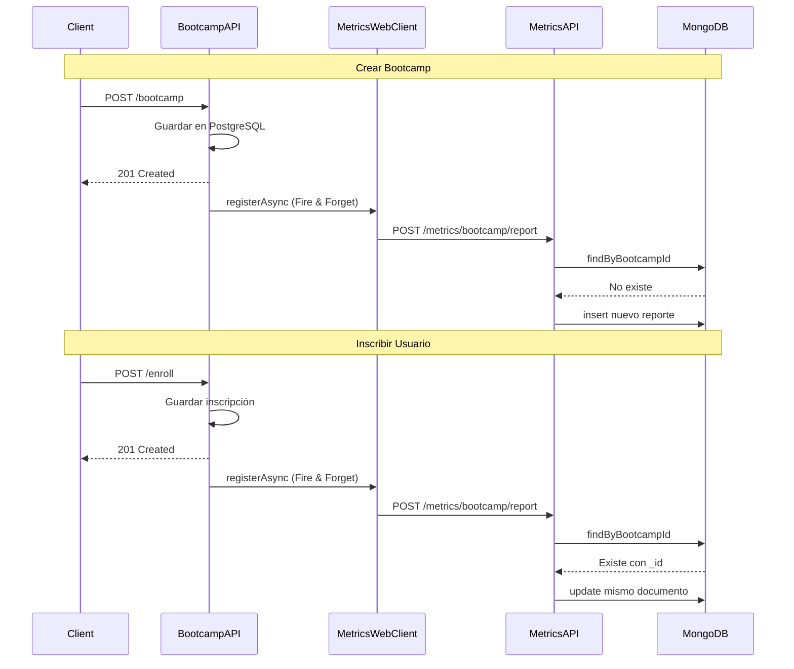

# 🔄 Actualización Automática de Reportes de Bootcamps

## 📋 Comportamiento Implementado

### ✅ Estrategia: UPSERT (Update or Insert)

El sistema utiliza una estrategia **UPSERT** que:
- **Crea** el reporte si no existe
- **Actualiza** el reporte si ya existe

Esto garantiza que siempre hay **UN SOLO REPORTE POR BOOTCAMP** en MongoDB.

---

## 🔄 Flujo de Actualización Automática

### 1️⃣ Al Crear un Bootcamp

```
Admin → POST /capacity/bootcamp
  ↓
Bootcamp creado en PostgreSQL
  ↓
[ASÍNCRONO] → POST /metrics/bootcamp/report
  ↓
MongoDB → Buscar reporte con bootcampId
  ↓
NO EXISTE → Crear nuevo reporte
  ↓
Reporte guardado con:
- bootcampId (unique index)
- Capacidades: 0 usuarios inscritos inicialmente
- Tecnologías calculadas
- enrolledUsers: []
```

**Código en BootcampHandlerImpl:**
```java
.doOnSuccess(savedBootcamp -> {
    log.info("Bootcamp created successfully with messageId: {}", messageId);
    // Fire and Forget - No bloquea el response
    metricsWebClient.registerBootcampReportAsync(
        savedBootcamp.id(), 
        messageId, 
        authToken
    );
})
```

**⏱️ Tiempo de respuesta:** Inmediato (el reporte se crea en background)

---

### 2️⃣ Al Inscribir un Usuario

```
User → POST /capacity/bootcamp/enroll
  ↓
Inscripción guardada en PostgreSQL
  ↓
[ASÍNCRONO] → POST /metrics/bootcamp/report
  ↓
MongoDB → Buscar reporte con bootcampId
  ↓
SÍ EXISTE → Actualizar reporte existente
  ↓
Reporte actualizado con:
- enrolledUsersCount: incrementado
- enrolledUsers: lista actualizada
- updatedAt: timestamp actual
```

**Código en EnrollmentHandlerImpl:**
```java
.doOnSuccess(enrollment -> {
    // Actualizar reporte sin afectar el rendimiento
    metricsWebClient.registerBootcampReportAsync(
        enrollmentRequest.getBootcampId(), 
        messageId, 
        authToken
    );
})
```

**⏱️ Tiempo de respuesta:** Inmediato (la actualización es asíncrona)

---

### 3️⃣ Al Desinscribir un Usuario

```
User → DELETE /bootcamp/{bootcampId}/user/{userId}
  ↓
Desinscripción en PostgreSQL
  ↓
[ASÍNCRONO] → POST /metrics/bootcamp/report
  ↓
MongoDB → Buscar reporte con bootcampId
  ↓
SÍ EXISTE → Actualizar reporte existente
  ↓
Reporte actualizado con:
- enrolledUsersCount: decrementado
- enrolledUsers: lista actualizada sin el usuario
- updatedAt: timestamp actual
```

**⏱️ Tiempo de respuesta:** Inmediato (la actualización es asíncrona)

---

## 🗄️ Implementación UPSERT en MongoDB

### Código en BootcampReportPersistenceAdapter

```java
@Override
public Mono<BootcampReport> save(BootcampReport bootcampReport) {
    return bootcampReportRepository.findByBootcampId(bootcampReport.bootcampId())
            .flatMap(existing -> {
                // ✅ ACTUALIZA: Mantiene el ID de MongoDB del documento existente
                var updated = bootcampReportMapper.toEntity(bootcampReport).toBuilder()
                        .id(existing.getId())  // Crucial: mantiene el mismo _id
                        .build();
                return bootcampReportRepository.save(updated);
            })
            .switchIfEmpty(
                // ✅ CREA: Solo si no existe
                Mono.defer(() -> 
                    bootcampReportRepository.save(
                        bootcampReportMapper.toEntity(bootcampReport)
                    )
                )
            )
            .map(bootcampReportMapper::toDomain);
}
```

### Índice Único en MongoDB

```javascript
// En la colección bootcamp_reports
{
  bootcampId: Long (UNIQUE INDEX)
}
```

**Esto garantiza que:**
- ✅ Solo puede existir UN reporte por bootcamp
- ✅ Búsquedas por bootcampId son muy rápidas (O(1))
- ✅ No se pueden crear reportes duplicados

---

## 📊 Ejemplo Práctico

### Escenario Completo

#### Paso 1: Crear Bootcamp
```http
POST /capacity/bootcamp
{
  "name": "Bootcamp Java",
  "capacityIds": [1, 2, 3]
}
```

**MongoDB después:**
```json
{
  "_id": "65b9c8f0e123...",
  "bootcampId": 1,
  "bootcampName": "Bootcamp Java",
  "enrolledUsersCount": 0,
  "enrolledUsers": [],
  "createdAt": "2026-01-22T10:00:00",
  "updatedAt": "2026-01-22T10:00:00"
}
```

#### Paso 2: Usuario 1 se inscribe
```http
POST /capacity/bootcamp/enroll
{
  "bootcampId": 1
}
```

**MongoDB después (MISMO DOCUMENTO):**
```json
{
  "_id": "65b9c8f0e123...",  // ⬅️ Mismo ID
  "bootcampId": 1,
  "bootcampName": "Bootcamp Java",
  "enrolledUsersCount": 1,  // ⬅️ Incrementado
  "enrolledUsers": [
    {
      "userId": 10,
      "userName": "María García",
      "userEmail": "maria@example.com"
    }
  ],
  "createdAt": "2026-01-22T10:00:00",
  "updatedAt": "2026-01-22T10:05:00"  // ⬅️ Actualizado
}
```

#### Paso 3: Usuario 2 se inscribe
```http
POST /capacity/bootcamp/enroll
{
  "bootcampId": 1
}
```

**MongoDB después (MISMO DOCUMENTO):**
```json
{
  "_id": "65b9c8f0e123...",  // ⬅️ Mismo ID
  "bootcampId": 1,
  "bootcampName": "Bootcamp Java",
  "enrolledUsersCount": 2,  // ⬅️ Incrementado
  "enrolledUsers": [
    {
      "userId": 10,
      "userName": "María García",
      "userEmail": "maria@example.com"
    },
    {
      "userId": 11,
      "userName": "Juan Pérez",
      "userEmail": "juan@example.com"
    }
  ],
  "createdAt": "2026-01-22T10:00:00",
  "updatedAt": "2026-01-22T10:10:00"  // ⬅️ Actualizado
}
```

#### Paso 4: Usuario 1 se desinscribe
```http
DELETE /bootcamp/1/user/10
```

**MongoDB después (MISMO DOCUMENTO):**
```json
{
  "_id": "65b9c8f0e123...",  // ⬅️ Mismo ID
  "bootcampId": 1,
  "bootcampName": "Bootcamp Java",
  "enrolledUsersCount": 1,  // ⬅️ Decrementado
  "enrolledUsers": [
    {
      "userId": 11,
      "userName": "Juan Pérez",
      "userEmail": "juan@example.com"
    }
  ],
  "createdAt": "2026-01-22T10:00:00",
  "updatedAt": "2026-01-22T10:15:00"  // ⬅️ Actualizado
}
```

---

## ✅ Ventajas de Este Enfoque

### 1. **Un Solo Reporte por Bootcamp**
- No hay duplicados
- Fácil de consultar
- Métricas siempre en un lugar

### 2. **Rendimiento No Afectado**
- Operaciones asíncronas (Fire and Forget)
- No bloquean el flujo principal
- Respuestas inmediatas al cliente

### 3. **Datos Siempre Actualizados**
- Cada inscripción/desinscripción actualiza el reporte
- Snapshot actualizado automáticamente
- No requiere consultas complejas

### 4. **Auditoría con Timestamps**
- `createdAt`: Cuándo se creó el bootcamp
- `updatedAt`: Última modificación (inscripción/desinscripción)

---

## 🔍 Verificación en MongoDB

### Ver todos los reportes
```javascript
db.bootcamp_reports.find().pretty()
```

### Ver cuántos reportes hay por bootcamp
```javascript
db.bootcamp_reports.aggregate([
  { $group: { _id: "$bootcampId", count: { $sum: 1 } } }
])
```

**Resultado esperado:** Siempre `count: 1` para cada bootcampId

### Ver histórico de actualizaciones
```javascript
db.bootcamp_reports.find(
  { bootcampId: 1 }, 
  { bootcampId: 1, enrolledUsersCount: 1, createdAt: 1, updatedAt: 1 }
)
```

---

## ⚠️ Consideraciones Importantes

### 1. **No es Auditoría**
Este sistema **NO** es para auditoría porque:
- ❌ Solo guarda el estado actual
- ❌ No guarda histórico de cambios
- ❌ No guarda quién hizo el cambio ni cuándo exactamente

### 2. **Es para Métricas**
Este sistema **SÍ** es para métricas porque:
- ✅ Snapshot actualizado del estado actual
- ✅ Contadores en tiempo real
- ✅ Consultas rápidas de reportes
- ✅ Ideal para dashboards

### 3. **Si Necesitas Auditoría**
Deberías implementar un sistema adicional que:
- Guarde eventos de cambio (Event Sourcing)
- Mantenga histórico completo
- Registre usuario, timestamp, acción

---

## 🎯 Resumen

| Acción | Comportamiento en MongoDB | Rendimiento |
|--------|--------------------------|-------------|
| **Crear Bootcamp** | Crea nuevo reporte | ✅ No afectado (async) |
| **Inscribir Usuario** | Actualiza reporte existente | ✅ No afectado (async) |
| **Desinscribir Usuario** | Actualiza reporte existente | ✅ No afectado (async) |

**Resultado:** Siempre **1 documento por bootcamp** con métricas actualizadas.

---

## 🔄 Flujo Técnico Detallado



---

## ✅ Conclusión

El sistema implementado es **perfecto para métricas** porque:

1. ✅ **Mantiene UN reporte por bootcamp** (no duplica)
2. ✅ **Actualiza automáticamente** en cada cambio
3. ✅ **No afecta el rendimiento** (todo asíncrono)
4. ✅ **Datos siempre actualizados** para consultas
5. ✅ **Ideal para dashboards** y reportes en tiempo real

**No es para auditoría**, pero cumple perfectamente su propósito de proporcionar métricas actualizadas de bootcamps.
